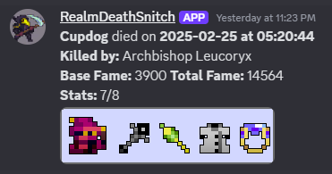

# RealmDeathSnitch

RealmDeathSnitch is a Discord bot that monitors a guild's graveyard and notifies a Discord channel when a player dies. 



## Installation Instructions

### Prerequisites

- Docker (for running the bot in a container)
- Python 3.9+

### Setting Up the Discord Bot

1. **Create a Discord Bot**:
   - Go to the [Discord Developer Portal](https://discord.com/developers/applications).
   - Click on "New Application" and give your bot a name.
   - Navigate to the "Bot" section and under Token click Reset Token.
   - Copy the bot token. You will need this later.
   - In the OAuth2 section under OAuth2 URL Generator select **bot**
        - A new selection field will appear under and select **Send Messages**
        - Using the Generated URL at the bottom you will be able to invite your bot to a discord server in which you have admin priviledges.

2. **Clone the Repository**:
   ```
   sh
   git clone https://github.com/yourusername/RealmDeathSnitch.git
   cd RealmDeathSnitch
   ```

3. **Create keys.env File**:
    In the RealmDeathSnitch directory, create a file named keys.env.
    Add the following content to keys.env:
    ```
    DISCORD_KEY=your_discord_bot_token
    GUILD_NAME=your_guild_name
    CHANNEL_ID=your_channel_id
    ```
### Running with Docker ###
1. **Build and Run the Docker Container**:
    - Ensure Docker is installed and running on your system.
    - Run the following script to build the Docker image and start the container:
    ```
    ./run.sh
    ```

### Running Directly with Python ###
1. **Install Dependencies**:
    - Ensure Python 3.9+ and pip are installed on your system.
    - Install the required packages using pip:
    ```
    pip install -r requirements.txt
    ```

2. **Run the Bot**:
    - Execute the bot script:
    ```
    python snitch_bot.py
    ```

## Additional Information

- The bot checks for new deaths every 60 seconds.
- The bot sends a message to the specified Discord channel with details about the player's death, including the player name, time of death, killer, base fame, total fame, and stats.

## Contributing

Contributions are welcome! Please fork the repository and submit a pull request.

## License

This project is licensed under the MIT License.
 